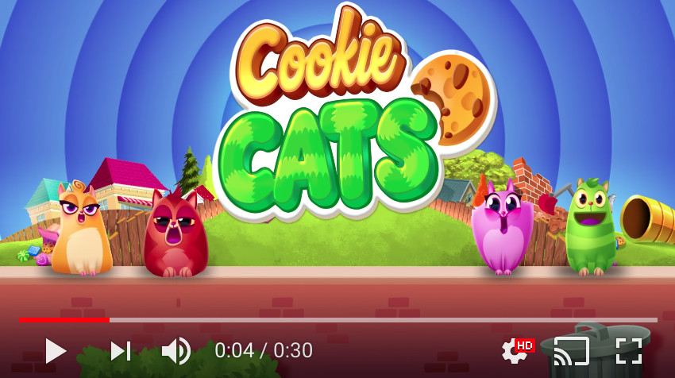

# Analyze an A/B test from the popular mobile puzzle game, Cookie Cats.

# About

Cookie Cats is a hugely popular mobile puzzle game developed by Tactile Entertainment. It's a classic "connect three"-style puzzle game where the player must connect tiles of the same color to clear the board and win the level. Check out this short demo:
{: width='40%' height='40%'}
