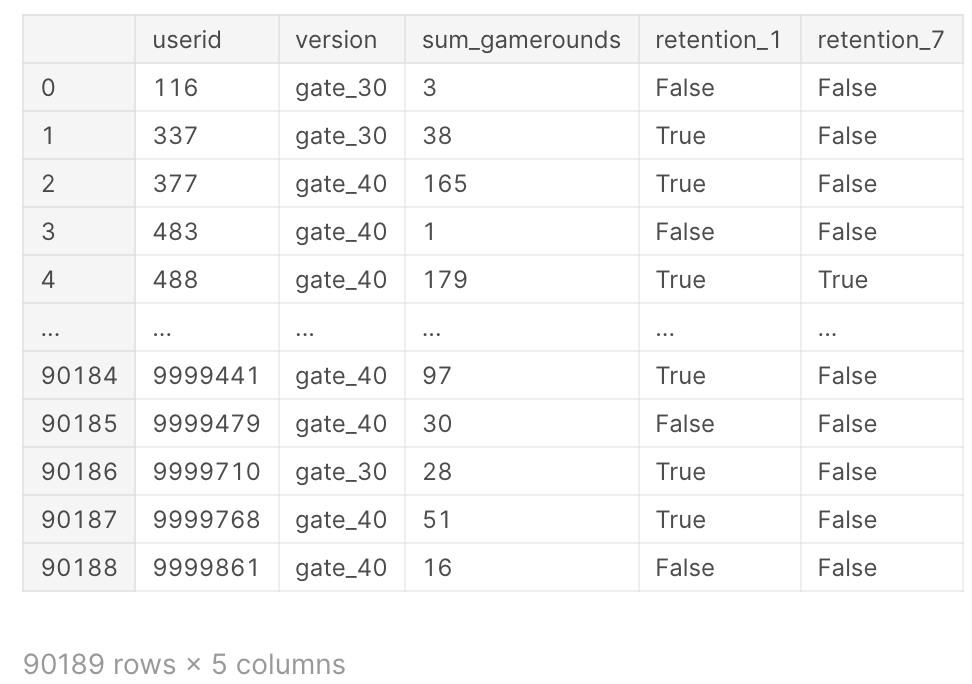

# Analyze an A/B test from the popular mobile puzzle game, Cookie Cats.

## About

Cookie Cats is a hugely popular mobile puzzle game developed by Tactile Entertainment. It's a classic "connect three"-style puzzle game where the player must connect tiles of the same color to clear the board and win the level. Check out this short demo:

As players progress through the levels of the game, they will occasionally encounter gates that force them to wait a non-trivial amount of time or make an in-app purchase to progress. In addition to driving in-app purchases, these gates serve the important purpose of giving players an enforced break from playing the game, hopefully resulting in that the player's enjoyment of the game being increased and prolonged.

But where should the gates be placed? Initially the first gate was placed at level 30, but in this notebook we're going to analyze an AB-test where we moved the first gate in Cookie Cats from level 30 to level 40. In particular, we will look at the impact on player retention.

## Data
The DataFrame contains 90189 rows, each representing a user session.
We also have 5 columns:

* `userid`:  A unique number that identifies each player.
* `version` : Whether the player was put in the control group (gate_30 - a gate at level 30) or the group with the moved gate (gate_40 - a gate at level 40)
* `sum_gamerounds` : The number of game rounds played by the player during the first 14 days after install.
* `retention_1` : Did the player come back and play 1 day after installing?
* `retention_7` : Did the player come back and play 7 days after installing?

## Pipeline
* Understanding the Data
* Remove Outliers
* Bootstraping
* Check for normality